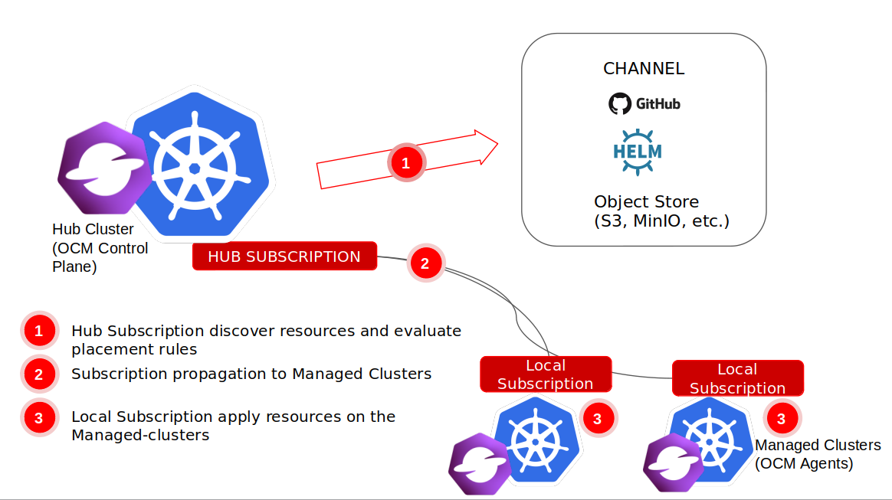

# multicloud-operators-subscription 

[](http://www.apache.org/licenses/LICENSE-2.0.html)

- [Overview](#overview)
- [Architecture](#architecture)
- [Stand-alone deployment](#stand-alone-deployment)
- [Multi-cluster deployment](#multi-cluster-deployment)
    - [Prerequisite](#prerequisite)
    - [Operator Deployment](#operator-deployment)
    - [Add-on Deployment](#add-on-deployment)
    - [What is next](#what-is-next)
- [GitOps subscription](#gitops-subscription)
- [Object storage subscription](#object-storage-subscription)
- [Community, discussion, contribution, and support](#community,-discussion,-contribution,-and-support)

## Overview

Subscriptions (subscription.apps.open-cluster-management.io) allow clusters to subscribe to a source repository [channel](https://github.com/open-cluster-management-io/multicloud-operators-channel) that can be the following types: Git repository, Helm release registry, or Object storage repository.

Subscriptions can point to a channel for identifying new or updated resource templates. The subscription operator can then download directly from the storage location and deploy to targeted managed clusters without checking the hub cluster first. With a subscription, the subscription operator can monitor the channel for new or updated resources instead of the hub cluster.

## Architecture



## Stand-alone deployment 

Deploy the subscription operator.

```shell
$ git clone https://github.com/open-cluster-management-io/multicloud-operators-subscription.git
$ cd multicloud-operators-subscription
$ make deploy-standalone
$ kubectl -n open-cluster-management get deploy  multicluster-operators-subscription
NAME                                READY   UP-TO-DATE   AVAILABLE   AGE
multicluster-operators-subscription   1/1     1            1           21m
```

Create a Helm channel and subscribe to it.

```shell
kubectl apply -f ./examples/helmrepo-channel
```

Find the nginx pods that are deployed to the current namespace. You should have 3 backend pods with the controller.

```shell
$ kubectl get pods -l app=nginx-ingress
NAME                                                    READY   STATUS    RESTARTS   AGE
nginx-ingress-simple-controller-6b57886cf8-pmqs5        1/1     Running   0          21m
nginx-ingress-simple-default-backend-666d7d77fc-cgfwn   1/1     Running   0          21m
nginx-ingress-simple-default-backend-666d7d77fc-q8gdg   1/1     Running   0          21m
nginx-ingress-simple-default-backend-666d7d77fc-wls8f   1/1     Running   0          21m
```

## Multi-cluster deployment

### Prerequisite

Install the `clusteradm` CLI tool. For more information see [here](https://open-cluster-management.io/getting-started/quick-start/#install-clusteradm-cli-tool).

Using `clusteradm`, deploy a cluster manager on your _hub_ cluster and deploy a klusterlet agent on your _managed_ cluster. For more information see [here](https://open-cluster-management.io/getting-started/quick-start/#deploy-a-cluster-manager-on-your-hub-cluster).

### Operator Deployment

Deploy the subscription operator on the _hub_ cluster.

```shell
$ kubectl config use-context <hub cluster context> # kubectl config use-context kind-hub
$ clusteradm install hub-addon --names application-manager
$ kubectl -n open-cluster-management get deploy  multicluster-operators-subscription
NAME                                READY   UP-TO-DATE   AVAILABLE   AGE
multicluster-operators-subscription   1/1     1            1           25s
$ kubectl -n open-cluster-management wait deploy multicluster-operators-subscription --for condition=available
```

### Add-on Deployment


Enable the subscription add-on for _managed_ cluster. For the value of `<managed cluster name>`, choose the managed cluster you want to install the add-on to by running the command `kubectl get managedclusters` on the _hub_ cluster.

```shell
$ kubectl config use-context <hub cluster context> # kubectl config use-context kind-hub
$ kubectl get managedclusters
NAME                        HUB ACCEPTED   MANAGED CLUSTER URLS      JOINED   AVAILABLE   AGE
<managed cluster name>      true           https://127.0.0.1:38745   True     True        21s
$ clusteradm addon enable --name application-manager --cluster <managed cluster name> # clusteradm addon enable --name application-manager --cluster cluster1
$ kubectl -n <managed cluster name> get managedclusteraddon # kubectl -n cluster1 get managedclusteraddon
NAME                  AVAILABLE   DEGRADED   PROGRESSING
application-manager   True
```

Check the the subscription add-on deployment on the _managed_ cluster.

```shell
$ kubectl config use-context <managed cluster context> # kubectl config use-context kind-cluster1
$ kubectl -n open-cluster-management-agent-addon get deploy application-manager
NAME                  READY   UP-TO-DATE   AVAILABLE   AGE
application-manager   1/1     1            1           103s
```

### What is next

After a successful deployment, test the subscription operator with a `helm` subscription. Run the following command:

```Shell
git clone https://github.com/open-cluster-management-io/multicloud-operators-subscription.git
cd multicloud-operators-subscription
kubectl config use-context <hub cluster context> # kubectl config use-context kind-hub
kubectl apply -f examples/helmrepo-hub-channel
```

After a while, you should see the subscription propagated to the managed cluster and the Helm app installed. By default, when a subscription deploys subscribed applications to target clusters, the applications are deployed to that subscription namespace. To confirm, run the following command:

```Shell
$ kubectl config use-context <managed cluster context> # kubectl config use-context kind-cluster1
$ kubectl get subscriptions.apps
NAME        STATUS       AGE    LOCAL PLACEMENT   TIME WINDOW
nginx-sub   Subscribed   107m   true
$ kubectl get pod
NAME                                                   READY   STATUS      RESTARTS   AGE
nginx-ingress-47f79-controller-6f495bb5f9-lpv7z        1/1     Running     0          108m
nginx-ingress-47f79-default-backend-7559599b64-rhwgm   1/1     Running     0          108m
```

## GitOps subscription

You can subscribe to public or enterprise Git repositories that contain Kubernetes resource YAML files or Helm charts, or both. See [Git repository channel subscription](docs/gitrepo_subscription.md) for more details.

## Object storage subscription

You can subscribe to cloud object storage that contain Kubernetes resource YAML files. See [Object storage channel subscription](docs/objectstorage_subscription.md) for more details.

## Community, discussion, contribution, and support

Check the [CONTRIBUTING Doc](CONTRIBUTING.md) for how to contribute to the repo.

### Communication channels

Slack channel: [#open-cluster-mgmt](http://slack.k8s.io/#open-cluster-mgmt)

## License

This code is released under the Apache 2.0 license. See the file LICENSE for more information.
